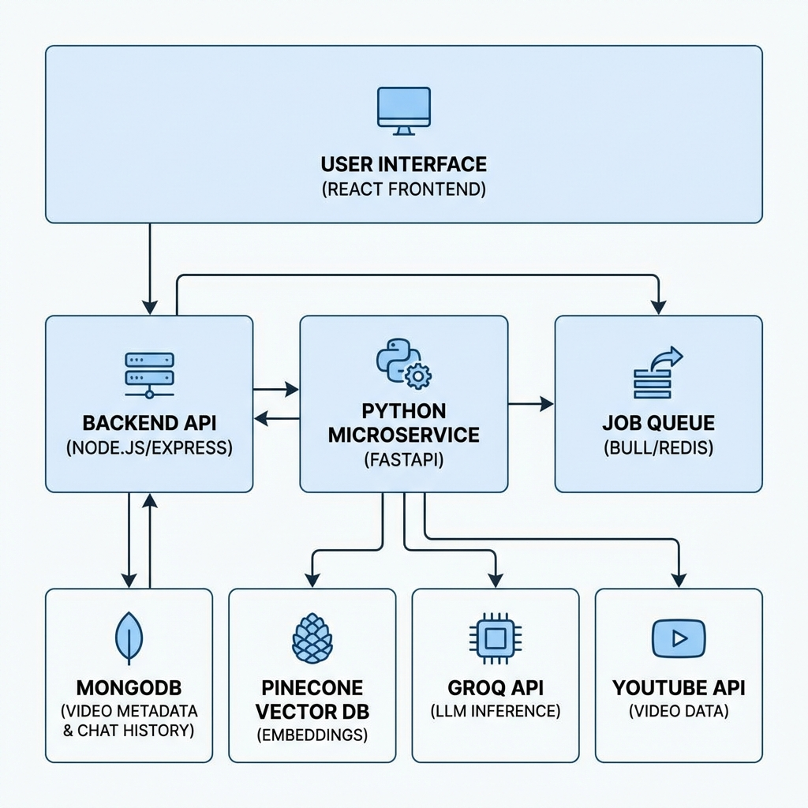
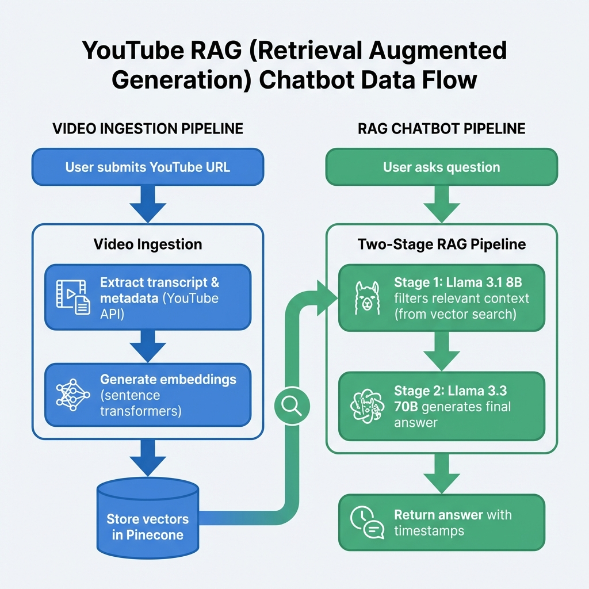

# YouTube RAG Chatbot 🎬

> An intelligent chatbot that understands YouTube videos through advanced RAG (Retrieval Augmented Generation) technology, enabling natural conversations about video content with precise timestamp navigation.



---

## 📋 Table of Contents

- [Overview](#overview)
- [How It Works](#how-it-works)
- [Key Features](#key-features)
- [System Architecture](#system-architecture)
- [Getting Started](#getting-started)
  - [Prerequisites](#prerequisites)
  - [Installation](#installation)
  - [Configuration](#configuration)
  - [Running the Application](#running-the-application)
- [Project Structure](#project-structure)
- [API Documentation](#api-documentation)
- [Tech Stack](#tech-stack)
- [License](#license)

---

## 🎯 Overview

YouTube RAG Chatbot transforms how you interact with video content. Instead of manually scrubbing through hours of footage, simply ask questions and get accurate answers with exact timestamps. The system uses a sophisticated two-stage RAG pipeline powered by state-of-the-art language models to deliver context-aware responses.

**Perfect for:**
- 📚 Educational content and tutorials
- 🎓 Lecture notes and study materials
- 🎙️ Podcast summaries and key points
- 📊 Conference talks and presentations

---

## 🧠 How It Works

The chatbot operates in two main phases:

### Phase 1: Video Ingestion
1. **User submits a YouTube URL**
2. **Transcript Extraction**: Fetches video transcript and metadata via YouTube API
3. **Embedding Generation**: Converts transcript segments into vector embeddings using sentence-transformers
4. **Vector Storage**: Stores embeddings in Pinecone for fast similarity search
5. **Progress Tracking**: Real-time updates via WebSocket

### Phase 2: Intelligent Q&A
1. **User asks a question** about the video
2. **Stage 1 - Context Filtering**: Llama 3.1 8B processes vector search results to identify the most relevant segments
3. **Stage 2 - Answer Generation**: Llama 3.3 70B generates a comprehensive answer using the filtered context
4. **Timestamp Extraction**: Returns answer with precise video timestamps
5. **Interactive Navigation**: Click timestamps to jump to relevant moments



---

## ✨ Key Features

| Feature | Description |
|---------|-------------|
| 🎬 **Video Embedding** | Embedded YouTube player with IFrame API for seamless playback control |
| 💬 **Real-time Chat** | Interactive chat interface with instant responses |
| 🤖 **Two-Stage RAG** | Token-optimized pipeline: Llama 3.1 8B → Llama 3.3 70B |
| ⏱️ **Timestamp Navigation** | Click timestamps in answers to jump directly to video moments |
| 📝 **Live Transcript** | Auto-scrolling transcript viewer with synchronized highlighting |
| 🔄 **Background Processing** | Asynchronous video ingestion with progress tracking |
| 🔍 **Vector Search** | Fast semantic search using sentence-transformers embeddings |
| 💾 **Session Persistence** | Chat history stored in MongoDB for later retrieval |

---

## 🏗️ System Architecture

### Components

**Frontend Layer:**
- **React 18 + TypeScript**: Component-based UI with type safety
- **Tailwind CSS**: Modern, responsive styling
- **Zustand**: Lightweight state management
- **Socket.io Client**: Real-time bidirectional communication

**Backend Layer:**
- **Express API**: RESTful endpoints for video and chat operations
- **Bull Queue**: Redis-based job queue for async processing
- **Socket.io Server**: WebSocket server for progress updates
- **MongoDB**: Document storage for videos and chat sessions

**Python Microservice:**
- **FastAPI**: High-performance async API
- **youtube-transcript-api**: Transcript extraction
- **sentence-transformers**: Embedding generation (all-MiniLM-L6-v2)

**External Services:**
- **Pinecone**: Vector database for embeddings (384 dimensions)
- **Groq API**: LLM inference (Llama 3.1 8B & 3.3 70B)
- **YouTube Data API**: Video metadata retrieval

---

## 🚀 Getting Started

### Prerequisites

Ensure you have the following installed:
- **Node.js** 20 or higher
- **Python** 3.10 or higher
- **Redis** (local installation or Upstash cloud)

You'll also need free accounts for:
- [MongoDB Atlas](https://www.mongodb.com/cloud/atlas/register) (Database)
- [Pinecone](https://app.pinecone.io/) (Vector Storage)
- [Groq](https://console.groq.com/) (LLM API - no credit card required)

---

### Installation

**1. Clone the repository**
```bash
git clone https://github.com/your-username/yt-ragbot.git
cd yt-ragbot
```

**2. Install Frontend Dependencies**
```bash
cd frontend
npm install
```

**3. Install Backend Dependencies**
```bash
cd ../backend
npm install
```

**4. Set Up Python Environment**
```bash
cd ../python-service
python -m venv venv

# Windows
.\venv\Scripts\activate

# Linux/Mac
source venv/bin/activate

pip install -r requirements.txt
```

---

### Configuration

#### MongoDB Atlas Setup
1. Create a free M0 cluster at [MongoDB Atlas](https://www.mongodb.com/cloud/atlas/register)
2. Go to **Database Access** → Add a new user with password
3. Go to **Network Access** → Add `0.0.0.0/0` (allow from anywhere)
4. Click **Connect** → Get your connection string

#### Pinecone Setup
1. Sign up at [Pinecone](https://app.pinecone.io/)
2. Create a new index with these settings:
   - **Name**: `youtube-transcripts`
   - **Dimensions**: `384`
   - **Metric**: `cosine`
3. Copy your API key from the dashboard

#### Groq Setup
1. Sign up at [Groq Console](https://console.groq.com/)
2. Navigate to **API Keys** → Create new key
3. Copy the key (starts with `gsk_`)

#### Environment Variables

**Backend** (`backend/.env`)
```env
MONGODB_URI=your_mongodb_connection_string
PINECONE_API_KEY=your_pinecone_api_key
GROQ_API_KEY=your_groq_api_key
REDIS_HOST=localhost
REDIS_PORT=6379
PORT=5000
```

**Frontend** (`frontend/.env`)
```env
VITE_API_URL=http://localhost:5000/api
VITE_WS_URL=http://localhost:5000
```

---

### Running the Application

You'll need **4 terminal windows** running simultaneously:

**Terminal 1: Redis Server** (if running locally)
```bash
redis-server
```

**Terminal 2: Python Microservice**
```bash
cd python-service
.\venv\Scripts\activate  # Windows
# source venv/bin/activate  # Linux/Mac
uvicorn app.main:app --reload --port 8000
```

**Terminal 3: Backend API**
```bash
cd backend
npm run dev
```

**Terminal 4: Frontend**
```bash
cd frontend
npm run dev
```

**Access the application:**
Open your browser and navigate to `http://localhost:5173`

---

## 📁 Project Structure

```
yt-ragbot/
├── frontend/                    # React Frontend Application
│   ├── src/
│   │   ├── components/         # React UI components
│   │   │   ├── VideoPlayer.tsx
│   │   │   ├── ChatInterface.tsx
│   │   │   ├── TranscriptViewer.tsx
│   │   │   └── ...
│   │   ├── services/          # API & WebSocket clients
│   │   ├── stores/            # Zustand state management
│   │   └── types/             # TypeScript interfaces
│   └── ...
│
├── backend/                     # Node.js Backend API
│   ├── src/
│   │   ├── config/            # Database & API configurations
│   │   ├── models/            # Mongoose schemas
│   │   ├── services/          # Business logic & RAG pipeline
│   │   │   ├── youtube.service.ts
│   │   │   ├── vectordb.service.ts
│   │   │   ├── query-orchestrator.service.ts
│   │   │   ├── rag-stage1.service.ts
│   │   │   └── rag-stage2.service.ts
│   │   ├── controllers/       # HTTP request handlers
│   │   ├── routes/            # Express routes
│   │   ├── queues/            # Bull job definitions
│   │   └── websocket/         # Socket.io server
│   └── ...
│
└── python-service/              # Python Microservice
    ├── app/
    │   ├── main.py             # FastAPI application
    │   ├── transcript_extractor.py
    │   └── embedding_generator.py
    └── ...
```

---

## 📡 API Documentation

### Video Endpoints

| Method | Endpoint | Description |
|--------|----------|-------------|
| `POST` | `/api/video/analyze` | Submit YouTube URL for processing |
| `GET` | `/api/video/:videoId/status` | Check ingestion status |
| `GET` | `/api/video/:videoId/transcript` | Retrieve full transcript |

### Chat Endpoints

| Method | Endpoint | Description |
|--------|----------|-------------|
| `POST` | `/api/chat/query` | Ask a question about a video |
| `GET` | `/api/chat/history/:videoId/:sessionId` | Get chat history |

### Python Service Endpoints

| Method | Endpoint | Description |
|--------|----------|-------------|
| `GET` | `/health` | Health check |
| `POST` | `/extract-transcript` | Extract YouTube transcript |
| `POST` | `/generate-embeddings` | Generate text embeddings |

---

## 🛠️ Tech Stack

### Frontend


### Backend


### Python Service


### AI & Vector DB


---

## 📄 License

This project is licensed under the MIT License - see the [LICENSE](LICENSE) file for details.

---

## 🤝 Contributing

Contributions are welcome! Please feel free to submit a Pull Request.

---

**Built with ❤️ using modern web technologies and AI**
